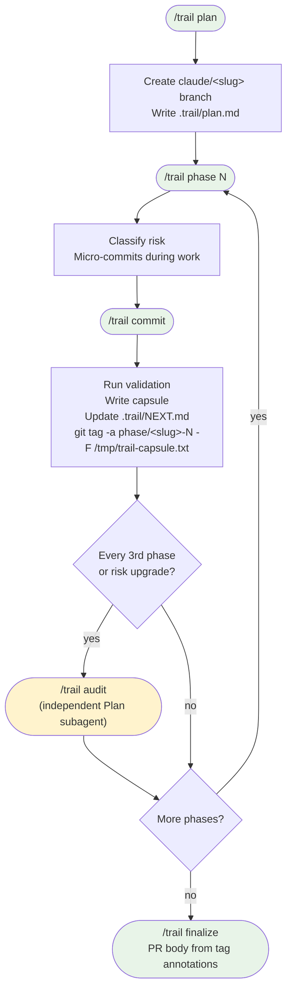

# Trail — phased implementation for Claude Code

Trail breaks large implementations into traceable phases on a feature branch.
Each phase ends with a **capsule** — a structured decision log stored in a git tag annotation.
Any future session, agent, or teammate can rejoin at any phase without re-deriving why things are the way they are.

Sibling to [trail-codex-skill](https://github.com/anuj81/trail-codex-skill); same methodology, rebuilt around Claude Code's skill model.

---

## How it works



**Key artifacts:**

| Artifact | Where | Survives merge to main? |
|---|---|---|
| Phase capsule | git tag annotation (`phase/<slug>-N`) | Yes — tags travel with commits |
| Micro-commits | branch history | Yes |
| NEXT.md | `.trail/NEXT.md` (gitignored) | No — branch-local only |
| Trace plan | `.trail/plan.md` (gitignored) | No — branch-local only |

---

## Quick start

```
/trail plan          → write the trace plan, approve, scaffold branch
/trail phase <N>     → start phase N (risk check + tasks + micro-commits)
/trail commit        → close phase: validate → capsule → tag → NEXT.md
/trail audit         → independent review (auto-required every 3rd phase)
/trail finalize      → PR body from tag annotations, ready for merge
/ts                  → read-only status check (instant, use freely)
```

---

## Install

```bash
git clone https://github.com/anuj81/trail-claude-skill.git
cd trail-claude-skill

mkdir -p ~/.claude/skills
cp -R skills/trail ~/.claude/skills/
cp -R skills/ts   ~/.claude/skills/
```

Or symlink to track updates:
```bash
ln -s "$(pwd)/skills/trail" ~/.claude/skills/trail
ln -s "$(pwd)/skills/ts"    ~/.claude/skills/ts
```

`references/` and `scripts/` live inside `skills/trail/`, so the copy includes everything.

**Add `.trail/` to your project's `.gitignore`:**
```bash
echo ".trail/" >> .gitignore
```
Trail uses `git add -f` to commit plan and NEXT files on the feature branch despite the gitignore. On merge to main, `.trail/` doesn't follow — the capsules in tag annotations are the durable record.

**Verify:**
```
claude
> /ts
```
Should show "(no phase tags yet)" in a fresh repo, or live phase state in a Trail-managed one.

---

## Opt-in hooks

Two hooks deepen Trail's enforcement. They're opt-in because **hooks are functionally equivalent to `allowed-tools`** — the scripts run on every matching tool call. Review `skills/trail/scripts/` before installing.

Install by merging `hooks/settings.snippet.json` into `~/.claude/settings.json` (see `hooks/README.md`).

### `guard-tag` — PreToolUse on Bash

Blocks `git tag phase/*` when any of these fail:

- Tag name doesn't follow `phase/<feature-slug>-N` (or `-attempt-K` suffix)
- Capsule annotation is missing required sections for the phase's risk level
- Annotation uses `-m "$(cat ...)"` — hooks see the shell command **before** evaluation, so command substitution arrives as literal text; use `-F /path/to/file` instead
- `.trail/NEXT.md` doesn't reference the next phase number (or "final"/"finalize"/"merge" for the last phase)
- A prior phase has a pending audit flag

Silent on every other Bash call. Set `TRAIL_HOOK_DEBUG=1` before launching Claude to log raw hook payloads to stderr.

### `Stop` — trace_status

Prints Trail state at session end as a safety net for context loss.
Self-suppresses on non-Trail repos.

---

## Phase discipline

### Risk classification

Run automatically at phase start via `phase_check.py classify-risk`:

| Risk | Signal |
|---|---|
| **High** | Path matches `auth`, `secret`, `credential`, `migration`, `schema`, `crypto` — or sits under `migrations/`, `db/`, `schemas/` |
| **Medium** | Path touched by ≥ 3 distinct authors in last 7 days |
| **Low** | Everything else |

Risk ratchets up, never down. If a planned-low phase looks high at start, upgrade and tell the user.

High-risk phases require `/review` (and `/security-review` if auth/secrets are involved) before tagging.

### Capsule format

Each phase tag holds a structured capsule in its annotation. Required sections for all phases:

```
Implementation:    What was built
Decisions:         Why this approach
Rejected:          Alternatives considered and dropped
Validation:        Commands run and their output
Risks / follow-ups: Known issues or open questions
Plan amendment:    Are remaining phases still correct?
Next:              What phase N+1 should start with
```

Medium/high risk also require:
```
Mental model:              Key invariants a reader needs to hold
Investigated and parked:   Things explored but not acted on
```

See `skills/trail/references/templates.md` for full templates.

### Audit cadence

After every 3rd phase (N % 3 == 0) and on any risk upgrade, `/trail commit` writes `.trail/audit-required-N.flag`. The `guard-tag` hook blocks the next phase tag until `/trail audit` clears it.

`/trail audit` forks a Plan subagent that reads the trace plan + all tag annotations and reports on plan-vs-reality. The subagent sees only tag annotations, never diffs — keeping review cost bounded regardless of codebase size.

---

## Sub-commands reference

| Command | What it does |
|---|---|
| `/trail plan` | Write trace plan in plan mode; user approves; scaffold branch + first commit |
| `/trail phase <N>` | Start phase N: risk classify, TaskCreate, implement with micro-commits |
| `/trail commit` | Close phase: validate → capsule → NEXT.md → `git tag -a ... -F /tmp/trail-capsule.txt` |
| `/trail audit` | Fork Plan subagent for independent review; clear audit flag on completion |
| `/trail finalize` | Gap-check phase sequence; generate PR description from tag annotations |
| `/trail resume` | Rejoin from current state (reads NEXT.md + latest tag) |
| `/trail capsule [N]` | Show tag annotation for phase N (latest if omitted) |
| `/trail rollback <N>` | Guided rollback: soft / revert / hard reset with trade-off explanation |
| `/ts` | Read-only status: branch, phase tags, latest capsule, NEXT.md, plan |

`/ts` is a separate skill (not `/trail status`) so it stays instant and one keystroke. If it collides with a future built-in `ts` skill, rename the directory: `mv ~/.claude/skills/ts ~/.claude/skills/trail-status`.

---

## Permissions

No mutating git operations are pre-approved. Branch creation, commits, tags, and resets all prompt for confirmation. This is deliberate — silent `git tag` or `git reset` is exactly the kind of surprise that erodes trust.

For lower friction after you've audited the skill, add to `~/.claude/settings.json`:

```json
{
  "permissions": {
    "allow": [
      "Bash(git switch -c claude/*)",
      "Bash(git tag -a phase/*)",
      "Bash(git commit *)",
      "Bash(git add -f .trail/*)"
    ]
  }
}
```

---

## Recovery

`skills/trail/references/recovery.md` covers:

- Resuming after context compaction or in a new session
- Three rollback options (branch-from-tag, revert, hard reset)
- Recording a failed phase as a permanent attempt tag (`phase/<slug>-N-attempt-K`)
- Recovering a missing `.trail/NEXT.md`
- Understanding guard-tag block messages
- Reconciling when transcript and repo disagree (repo always wins)

---

## Limitations

- Requires git. Tags are the spine of the system.
- Phase tag namespace can collide if two developers both push `phase/add-export-1` on parallel branches. Slug discrimination makes this unlikely but not impossible.
- `guard-tag` checks capsule structure, not truth. Validation results can be fabricated. For high-stakes work, configure CI to re-run validation against each `phase/*` tag.
- `/trail` is context-heavy. Use `/ts` for status checks during active sessions.

---

## Smoke tests

```bash
# trace_status self-suppresses on non-Trail repos
python3 skills/trail/scripts/trace_status.py .

# Namespace enforcement (exit 0 = ok, exit 2 = blocked)
python3 skills/trail/scripts/phase_check.py enforce-namespace phase/add-export-1   # ok
python3 skills/trail/scripts/phase_check.py enforce-namespace phase/BAD_NAME       # exit 2

# Risk classification
python3 skills/trail/scripts/phase_check.py classify-risk src/auth/middleware.ts   # high
python3 skills/trail/scripts/phase_check.py classify-risk src/components/Btn.tsx   # low

# Audit flag lifecycle (run inside a git repo with .trail/ directory)
python3 skills/trail/scripts/phase_check.py mark-audit-required 3
ls .trail/audit-required-3.flag
python3 skills/trail/scripts/phase_check.py clear-audit-flags
```

---

## License

MIT. See LICENSE.
