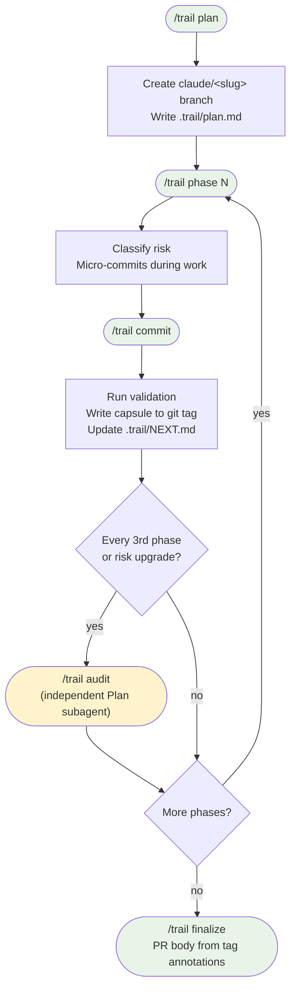

# Trail — phased implementation discipline for Claude Code


---

## The problem

AI-assisted coding sessions are stateless by nature. Context windows compress, sessions end, new agents start cold. Each restart, the *why* behind decisions — the alternatives considered, the risks accepted, the validation done — has to be re-derived from code and comments that were never written to carry that weight.

For a one-hour task this barely matters. For anything that spans multiple sessions, phases, or contributors, it compounds into drift: plans diverge from execution, validation gets skipped under pressure, and the next agent (or teammate) has no reliable way to know what state the work is actually in.

**Trail treats the git repo as the durable memory.** Every phase boundary produces a structured decision capsule stored in a git tag annotation — immutable, atomic with the code state it describes, readable by any future session without the chat transcript.

---

## How it works



**What survives a session restart or merge to main:**

| Artifact | Stored in | Persists after merge? |
|---|---|---|
| Decision capsule | git tag annotation `phase/<slug>-N` | Yes — tags travel with commits |
| Micro-commits | branch history | Yes |
| Live handoff note | `.trail/NEXT.md` (gitignored) | No — branch-local only |
| Trace plan | `.trail/plan.md` (gitignored) | No — branch-local only |

The capsules are the spine. `.trail/` files are scratch space.

---

## Quick start

```
/trail plan          → write the trace plan, approve, scaffold branch
/trail phase <N>     → start phase N (risk check + tasks + micro-commits)
/trail commit        → close phase: validate → capsule → tag → NEXT.md
/trail audit         → independent review (auto-required every 3rd phase)
/trail finalize      → generate PR body from tag annotations
/ts                  → read-only status check (instant, no side effects)
```

---

## Install

```bash
git clone https://github.com/anuj81/trail-claude-skill.git
cd trail-claude-skill

mkdir -p ~/.claude/skills
cp -R skills/trail ~/.claude/skills/
cp -R skills/ts   ~/.claude/skills/
```

Or symlink to track updates:
```bash
ln -s "$(pwd)/skills/trail" ~/.claude/skills/trail
ln -s "$(pwd)/skills/ts"    ~/.claude/skills/ts
```

**Add `.trail/` to your project's `.gitignore`:**
```bash
echo ".trail/" >> .gitignore
```

Trail uses `git add -f` to commit plan and NEXT files on the feature branch despite the gitignore. On merge to main, `.trail/` doesn't follow — the capsules in tag annotations are the durable record.

**Verify:**
```
claude
> /ts
```

Should show `(no phase tags yet)` in a fresh repo, or live phase/capsule state in a Trail-managed one.

---

## Opt-in hooks

Two hooks deepen enforcement. Opt-in because **hooks are functionally equivalent to `allowed-tools`** — the scripts run on every matching tool call. Review `skills/trail/scripts/` before installing.

See `hooks/README.md` for install instructions.

### `guard-tag` — PreToolUse on Bash

Blocks `git tag phase/*` when any of these fail:

- Tag name doesn't follow `phase/<feature-slug>-N` (or `-attempt-K` suffix)
- Capsule annotation is missing required sections for the phase's risk level
- Annotation uses `-m "$(cat ...)"` — hooks see the shell command **before** evaluation, so command substitution arrives as literal text; use `-F /path/to/file` instead
- `.trail/NEXT.md` doesn't reference the next phase (or "final"/"finalize"/"merge" for the last phase)
- A prior phase has a pending audit flag

Silent on every other Bash call. Set `TRAIL_HOOK_DEBUG=1` before launching Claude to log raw hook payloads to stderr.

### `Stop` — trace_status

Prints Trail state at session end as a context-loss safety net.
Self-suppresses on non-Trail repos.

---

## Phase discipline

### Risk classification

Run automatically at phase start:

| Risk | Signal |
|---|---|
| **High** | Path matches `auth`, `secret`, `credential`, `migration`, `schema`, `crypto`, or sits under `migrations/`, `db/`, `schemas/` |
| **Medium** | Path touched by ≥ 3 distinct authors in the last 7 days |
| **Low** | Everything else |

Risk ratchets up, never down. High-risk phases require `/review` (and `/security-review` if auth/secrets are involved) before tagging.

### Capsule sections

Required for all phases:

```
Implementation:      What was built
Decisions:           Why this approach
Rejected:            Alternatives considered and dropped
Validation:          Commands run and their output
Risks / follow-ups:  Known issues or open questions
Plan amendment:      Are remaining phases still correct?
Next:                What phase N+1 should start with
```

Medium/high risk also require:
```
Mental model:              Key invariants a future reader needs
Investigated and parked:   Things explored but not acted on
```

### Audit cadence

After every 3rd phase and on risk upgrades, `/trail commit` writes `.trail/audit-required-N.flag`. The `guard-tag` hook blocks the next phase tag until `/trail audit` clears it.

`/trail audit` forks an independent Plan subagent that reads the trace plan and all tag annotations — never diffs. Review cost stays bounded regardless of codebase size.

---

## Sub-commands

| Command | What it does |
|---|---|
| `/trail plan` | Write trace plan in plan mode; user approves; scaffold branch |
| `/trail phase <N>` | Start phase N: risk classify, TaskCreate, micro-commits |
| `/trail commit` | Close phase: validate → capsule → NEXT.md → tag |
| `/trail audit` | Fork Plan subagent for independent review; clear audit flag |
| `/trail finalize` | Gap-check phases; generate PR description from tag annotations |
| `/trail resume` | Rejoin from current state (reads NEXT.md + latest tag) |
| `/trail capsule [N]` | Show tag annotation for phase N (latest if omitted) |
| `/trail rollback <N>` | Guided rollback with soft / revert / hard reset options |
| `/ts` | Read-only status: branch, tags, latest capsule, NEXT.md |

`/ts` is a separate skill so it stays instant and one keystroke. If it collides with a future built-in, rename the directory: `mv ~/.claude/skills/ts ~/.claude/skills/trail-status`.

---

## Permissions

No mutating git operations are pre-approved. Branch creation, commits, tags, and resets all prompt for confirmation.

For lower friction after you've audited the skill, add to `~/.claude/settings.json`:

```json
{
  "permissions": {
    "allow": [
      "Bash(git switch -c claude/*)",
      "Bash(git tag -a phase/*)",
      "Bash(git commit *)",
      "Bash(git add -f .trail/*)"
    ]
  }
}
```

---

## Recovery

`skills/trail/references/recovery.md` covers:

- Resuming after compaction or in a new session
- Three rollback options (branch-from-tag, revert, hard reset)
- Recording a failed phase as a permanent attempt tag (`phase/<slug>-N-attempt-K`)
- Recovering a missing `.trail/NEXT.md`
- Understanding guard-tag block messages
- Reconciling when transcript and repo disagree (repo always wins)

---

## Background

Trail grew out of work on [Eunomia](https://eunomiaai.github.io/) — an open-source AI governance framework — where multi-session, AI-assisted development needed the same auditability guarantees we expect from any data pipeline: checkpoints, structured handoffs, and an immutable record of decisions at each stage.

The Codex version ([trail-codex-skill](https://github.com/anuj81/trail-codex-skill)) predates this one. Claude Code's skill model — dynamic context injection, hook enforcement, structured tool grants — made it possible to move the discipline from documentation into the runtime.

---

## Limitations

- Requires git. Tags are the spine of the system.
- Phase tag namespace can collide if two developers push `phase/add-export-1` on parallel branches. Slug discrimination makes this unlikely but not impossible.
- `guard-tag` checks capsule structure, not truth. For high-stakes work, configure CI to re-run validation against each `phase/*` tag.
- `/trail` is context-heavy. Use `/ts` for status checks during active sessions.

---

## Smoke tests

```bash
# trace_status self-suppresses on non-Trail repos
python3 skills/trail/scripts/trace_status.py .

# Namespace enforcement (exit 0 = ok, exit 2 = blocked)
python3 skills/trail/scripts/phase_check.py enforce-namespace phase/add-export-1   # ok
python3 skills/trail/scripts/phase_check.py enforce-namespace phase/BAD_NAME       # exit 2

# Risk classification
python3 skills/trail/scripts/phase_check.py classify-risk src/auth/middleware.ts   # high
python3 skills/trail/scripts/phase_check.py classify-risk src/components/Btn.tsx   # low

# Audit flag lifecycle (run inside a git repo)
python3 skills/trail/scripts/phase_check.py mark-audit-required 3
ls .trail/audit-required-3.flag
python3 skills/trail/scripts/phase_check.py clear-audit-flags
```

---

## License

MIT. See LICENSE.
